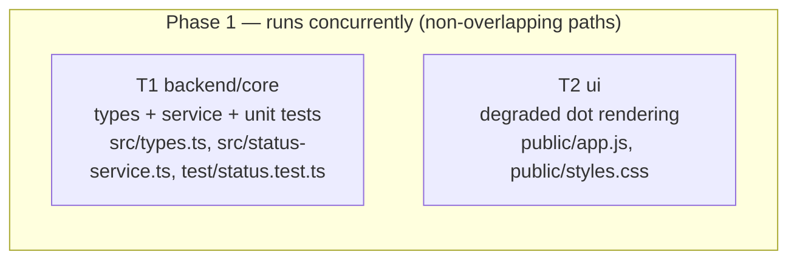

# Implementation Plan: Derived health `state` field on the status payload

## Overview
Add a derived `state: "healthy" | "degraded"` field to the `/status.json` payload, computed fresh
on every request from the process heap-usage ratio (`heapUsed / heapTotal`) against an
env-configurable threshold (`PULSE_DEGRADED_HEAP_RATIO`, default `0.9`), failing safe to `"healthy"`
when the ratio is non-computable. The framework-free front-end pulse dot gains a third, visually
distinct amber "degraded" appearance while keeping the existing green (healthy) and red (unreachable)
behaviour. Source of truth: `specs/SPEC-2026-07-17-status-state-field.md` (approved).

## Execution mode
multi-agent (parallel) — chosen to match the stated context (this is one of two features being
built concurrently on branch `feature/status-uptime-and-health` as a pipeline demo). The work splits
cleanly along a backend task (`src/**` + backend tests) and a front-end task (`public/**`) with
strictly non-overlapping Owned paths, so two implementers can run at once.

> NOTE — AskUserQuestion is unavailable to a planning subagent, so the two open choices below
> (degraded dot animation; pure-helper extraction) were resolved with safe defaults rather than
> confirmed with the user. Both defaults are cosmetic/internal and do not change the plan's shape or
> any acceptance criterion. Status: READY (not DRAFT) — the approved spec fully specifies behaviour.

## Requirements (verified)
- Source: `specs/SPEC-2026-07-17-status-state-field.md` (approved) — ACs: AC-1 .. AC-11.
- Deltas / disputes: none. The plan implements the spec as written.
- Assumed defaults (unconfirmed — see Open questions):
  - Degraded dot styling = **amber pulse** (spec's own open question; AC-9 only requires distinctness).
  - Classification + threshold parsing extracted as **pure exported helpers** in `status-service.ts`
    (spec-neutral internal design choice that makes AC-5 and AC-7 deterministically unit-testable
    without mocking `process.memoryUsage()`).

## Open questions & recommendations
- Q: Degraded dot — amber pulse or steady amber? → default: **amber pulse** (keeps motion consistent
  with healthy, distinct by hue). Either satisfies AC-9; purely cosmetic.
- Rec: Extract `resolveThreshold(raw)` and `classifyState(heapUsed, heapTotal, threshold)` as pure,
  exported functions; `getStatus()` composes them. This is the only way to hit AC-7's non-finite
  branch deterministically in a unit test without mocking Node internals, and it keeps the core
  classification logic pure (onion-architecture: pure domain logic, no I/O). Adopted as the default.
- Rec: Do **not** add a response JSON schema to the route. The route currently returns `getStatus()`
  with Fastify's default serializer; adding a schema now would risk stripping the new field and is
  out of scope. The additive field flows through automatically.
- Rec: Do **not** add a front-end test harness. `public/` is framework-free and CLAUDE.md forbids a
  build step / UI framework, so AC-8..AC-11 are verified by manual observation + no regression in the
  existing Fastify suite (see Testing strategy).

## Affected modules & contracts
- **pulse-board (single module)** — backend service `src/status-service.ts` gains the classification
  logic; shared shape `src/types.ts` gains one field; front-end `public/app.js` + `public/styles.css`
  gain the degraded rendering. `src/routes/status.ts` is **unchanged** (returns `getStatus()` as-is).
- **Contracts:** no new contract file. One additive field on the existing `StatusSnapshot` interface.
  - **SHARED TOUCH POINT — `src/types.ts`:** the sibling feature
    (`specs/SPEC-2026-07-17-health-liveness-endpoint.md`, planned/implemented separately) also edits
    `src/types.ts`, adding a distinct `HealthSnapshot` interface. Within *this* plan, only **T1**
    touches `src/types.ts`, and it does so **additively** (adds `state` to `StatusSnapshot`; touches
    nothing else). The two edits are non-conflicting by content but land in the same file — see Risks
    for the cross-plan coordination note.

## Architecture changes
- `src/types.ts` (ports / shared shape) — add `state: "healthy" | "degraded"` to `StatusSnapshot`.
- `src/status-service.ts` (application + pure core) — add two pure exported helpers
  (`resolveThreshold`, `classifyState`) and compose them inside `getStatus()`, which reads
  `process.memoryUsage()` and `process.env.PULSE_DEGRADED_HEAP_RATIO` fresh on each call. No stored
  state, no I/O, no persistence (honours the stateless design and AC-6).
- `public/app.js` + `public/styles.css` (transport / static UI) — map `data.state` to a `degraded`
  CSS class; add amber `.dot.degraded` styling; preserve `.dot.down` precedence.

## Task graph (multi-agent)

Both tasks are independent (no shared Owned paths, no dependency) and run in parallel: `T1` →
`implementer-backend`, `T2` → `implementer-ui`.

## Phased tasks

### Phase 1 — Backend classification + front-end rendering (concurrent)

- **T1**
  - **Action:**
    1. In `src/types.ts`, add `state: "healthy" | "degraded"` to the `StatusSnapshot` interface —
       additive only; do not reorder, rename, or remove existing fields (`version`, `uptimeSeconds`,
       `lastCheckedAt`), and do not touch anything the sibling health spec will add.
    2. In `src/status-service.ts`, add an exported pure `resolveThreshold(raw: string | undefined)`
       returning a `number`: parse `raw`; return the default `0.9` when `raw` is missing/empty,
       non-numeric (`NaN`), or outside the range `(0, 1]`; otherwise return the parsed value. No
       throwing (AC-4, AC-5).
    3. In `src/status-service.ts`, add an exported pure
       `classifyState(heapUsed: number, heapTotal: number, threshold: number)` returning
       `"healthy" | "degraded"`: if `heapTotal === 0` or the computed `heapUsed / heapTotal` ratio is
       not finite, return `"healthy"` (fail-safe, no throw — AC-7); else return `"degraded"` when
       `ratio >= threshold` (boundary is degraded — AC-3) and `"healthy"` otherwise (AC-2).
    4. In `getStatus()`, read `process.memoryUsage()` and `process.env.PULSE_DEGRADED_HEAP_RATIO`
       fresh on each call and set `state` by composing the two helpers. Keep the existing three fields
       unchanged. No module-level caching of the metrics/threshold; no fs/db access (AC-1, AC-6).
    5. In `test/status.test.ts`, add unit tests covering: `state` present and ∈ {healthy,degraded}
       with existing fields intact (AC-1); `classifyState` below threshold → healthy (AC-2); at and
       above threshold → degraded incl. the `ratio == threshold` boundary (AC-3); `resolveThreshold`
       returns `0.9` for unset and for each invalid input `""`, `"abc"`, `"0"`, `"-1"`, `"2"`, and
       returns a valid in-range value when set (AC-4, AC-5); `classifyState(x, 0, t)` and a non-finite
       ratio → healthy without throwing (AC-7). Drive the degraded branch of `getStatus()` by setting
       `PULSE_DEGRADED_HEAP_RATIO` to a very low value (restore/delete the env var after the test).
  - **Module:** pulse-board
  - **Type:** backend
  - **Skills to use:** typescript-expert, onion-architecture (pure core vs application composition),
    security (env var is server-controlled config, not untrusted input — no info-disclosure surface;
    parse defensively for correctness only), react-testing-library is N/A — use vitest unit style.
  - **Owned paths:** `src/types.ts`, `src/status-service.ts`, `test/status.test.ts`
  - **Depends-on:** none
  - **Covers:** AC-1, AC-2, AC-3, AC-4, AC-5, AC-6, AC-7
  - **Risk:** low
  - **Known gotchas:**
    - `src/types.ts` is a **shared touch point** with the sibling health spec — edit it purely
      additively and touch only `StatusSnapshot` so a concurrent/subsequent edit for `HealthSnapshot`
      does not conflict.
    - ESM convention (CLAUDE.md): relative imports carry the `.js` extension from `.ts` sources.
    - Keep all classification logic in `status-service.ts` per CLAUDE.md ("business logic lives in
      `*-service.ts`"); the route must stay a thin pass-through — do not add logic there.
    - Restore `process.env.PULSE_DEGRADED_HEAP_RATIO` between tests to avoid cross-test leakage.
  - **Acceptance:** `npm run typecheck` passes and `npm test` passes with the new unit tests green;
    `GET /status.json` (existing app test) still returns 200 with `version` present, and a manual
    `curl` / inject of `/status.json` shows `state` ∈ {`"healthy"`,`"degraded"`} alongside the
    existing fields.

- **T2**
  - **Action:**
    1. In `public/app.js` `refresh()` success path (after `dot.classList.remove("down")`), read
       `data.state`; add the `degraded` class when `data.state === "degraded"`, otherwise remove it
       so any non-`"degraded"` value — including missing/unknown — renders healthy (AC-8, AC-11).
    2. Leave the `catch` (failed/non-OK fetch) path adding the `down` class exactly as today (AC-10);
       ensure the `down` styling visually wins even if `degraded` is still present (see gotcha).
    3. In `public/styles.css`, add a `.dot.degraded` rule giving an amber dot (e.g. `#ff9500`) with a
       pulsing animation (amber pulse — the assumed default), visually distinct from the green healthy
       dot and the red `.dot.down` dot (AC-9). Keep the existing `.dot` (green pulse) and `.dot.down`
       (red, no animation) rules; ensure `.dot.down` is declared **after** `.dot.degraded` so an
       unreachable-while-previously-degraded dot renders red.
    4. No change to `public/index.html` (the `#dot` element already exists); no build step, no new
       dependency, no UI framework (CLAUDE.md).
  - **Module:** pulse-board
  - **Type:** ui
  - **Skills to use:** frontend-architecture (keep the static, framework-free structure),
    security (rendered `state` is a server-derived enum string, not user input; class toggle only —
    no `innerHTML`, so no XSS surface).
  - **Owned paths:** `public/app.js`, `public/styles.css`
  - **Depends-on:** none
  - **Covers:** AC-8, AC-9, AC-10, AC-11
  - **Risk:** low
  - **Known gotchas:**
    - Class precedence: if the dot is `degraded` and then the fetch fails, both `down` and `degraded`
      may be present. Guarantee red wins by declaring `.dot.down` after `.dot.degraded` in the
      stylesheet (belt-and-suspenders: the `catch` path may also remove `degraded`).
    - Do not turn `data.state` into text/HTML — only toggle a class (forward-compatible with unknown
      values per AC-11).
  - **Acceptance:** manual observation on `npm run dev`: a healthy poll shows the green pulsing dot
    with no `degraded`/`down` class; forcing degraded (run with a very low
    `PULSE_DEGRADED_HEAP_RATIO`) turns the dot amber and distinct; stopping the server / a failed
    fetch shows the red `down` dot; a response with absent/unknown `state` renders healthy. Existing
    `npm test` (page served at `/`, JSON at `/status.json`) still passes — no regression.

## Testing strategy
- **Unit (backend, T1):** `npm test` (vitest) — add cases to `test/status.test.ts` for
  `classifyState`, `resolveThreshold`, and `getStatus().state`, covering AC-1..AC-7 including the
  boundary (`ratio == threshold`), invalid-threshold fallbacks, and the non-finite / `heapTotal == 0`
  fail-safe. Reset `process.env.PULSE_DEGRADED_HEAP_RATIO` between tests.
- **Type safety:** `npm run typecheck` (`tsc --noEmit`) must pass with the widened `StatusSnapshot`.
- **Integration (existing):** `test/app.test.ts` continues to assert `/` serves HTML and
  `/status.json` returns 200 with `version` — confirms the additive field did not break the route.
- **Front-end (T2):** no automated harness exists and none is to be added (framework-free `public/`,
  CLAUDE.md). Verify AC-8..AC-11 manually via `npm run dev`, using a low `PULSE_DEGRADED_HEAP_RATIO`
  to force the amber state and by stopping the server to force the red `down` state.

## Risks & mitigations
- **Shared `src/types.ts` edit across two concurrent features** → both edits are strictly additive to
  different symbols (`StatusSnapshot.state` here vs a new `HealthSnapshot` in the sibling plan). If the
  two implementers ever run truly simultaneously on the same branch, a textual merge is trivial; to
  eliminate even that, sequence the two `types.ts` edits (this plan's T1 first or the health plan's
  types task first). Mitigation owned at the orchestrator level, not within a single task.
- **Route serialization dropping the field** → mitigated by *not* introducing a response JSON schema;
  Fastify's default serializer passes the whole object through. The existing app test guards regression.
- **Env var misread as untrusted input** → `PULSE_DEGRADED_HEAP_RATIO` is operator/server config and
  only the derived enum string is surfaced (never the raw threshold), so no info-disclosure or
  injection surface is added; parsing is defensive purely for correctness (AC-5).
- **Degraded/down class collision on the dot** → CSS source order (`.dot.down` after `.dot.degraded`)
  plus optional class cleanup in the `catch` path guarantees the unreachable state renders red.

## Red-flags check
- [x] Every requirement maps to a task (AC-1..AC-7 → T1; AC-8..AC-11 → T2)
- [x] Every AC-N from the spec is covered by at least one task's `Covers`
- [x] No specification was authored or edited — the approved spec was taken as input
- [x] Execution mode recorded (multi-agent) and the plan is shaped for it (two non-overlapping tasks)
- [x] Dependencies form a DAG (T1 and T2 both `Depends-on: none`; no cycles)
- [x] (multi-agent) Concurrent tasks have non-overlapping Owned paths (`src/**`+`test/` vs `public/**`)
- [x] Every Acceptance is measurable (typecheck/test commands, named AC observables, manual steps)
- [x] No edits to existing shared contracts without an explicit callout (`src/types.ts` flagged as a
      shared touch point; additive-only)
- [x] No AC prose restated from the spec (referenced by AC-ID only)
- [x] No task `Action` has 10+ numbered steps; no sub-5-minute sibling tasks left unmerged (the
      one-line `types.ts` edit is bundled into T1 rather than spun out as its own cold-start task)
- [x] Every cross-cutting Owned path is grep-verified — `StatusSnapshot` lives in `src/types.ts:1`;
      `getStatus` in `src/status-service.ts:5`; the route pass-through in `src/routes/status.ts:5`
      (unchanged); the dot element `#dot` in `public/index.html:12`; dot styling in
      `public/styles.css:57-68`; fetch/render in `public/app.js:10-26`
- [x] No deleted/narrowed shared symbol — the change is purely additive (widening `StatusSnapshot`),
      so no consumer sweep for removals is required; existing consumers keep compiling
- [x] No new runner/registry-discovered file — tests are added to the existing `test/status.test.ts`,
      already matched by vitest's default discovery
